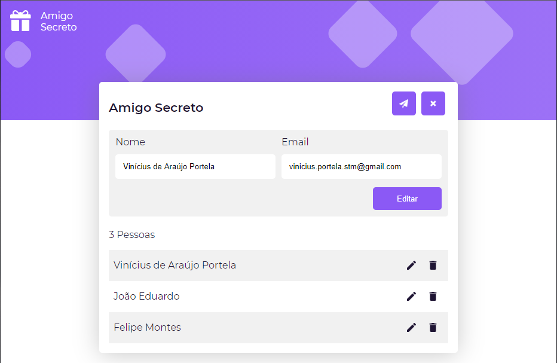

# Secret Friend

Breve projeto para cadastrar uma lista de amigos e sortear o seu amigo secreto, construído com ReactJS (front) e NodeJS (backend).



# Instruções

As instruções específicas de cada parte (front e back) estão localizados no README das respectivas pastas.

# Heroku Deploy

O deploy para o heroku é **completamente opcional** (inclusive se for testar / avaliar, recomendo até que siga as instruções de cada sub-projeto invés de realizar o deploy no heroku)

Os projetos front e back foram feitos para trabalharem individualmente usando a forma de deploy que for mais conveniente, para realizar o deploy para o heroku realize as seguintes instruções:

## 1. Adicione 2 ambientes de desenvolvimento

Essa etapa serve para conseguir usar as duas pastas (frontend e backend) em servidores do heroku diferentes.

> Veja: https://devcenter.heroku.com/articles/multiple-environments

Neste caso, os dois ambientes serão: _frontend_ e _backend_

`heroku create --remote frontend`

`heroku create --remote backend`

## 2. Deploy do Backend

Insira as variáveis de ambiente (pode ser pelo Heroku Dashboard também):

`heroku config:set MONGO_HOST=mongohosthere --remote backend`

`heroku config:set MONGO_DATABASE=mongodatabasehere --remote backend`

[...]

Repita para as todas as variáveis de ambiente (menos o PORT):

```
backend/.env.example

# MongoDB
MONGO_HOST=mongohosthere
MONGO_DATABASE=mongodatabasehere
MONGO_USER=mongouserhere
MONGO_PASSWORD=mongopasswordhere

# Gmail
GMAIL_USERNAME=gmailemailhere
GMAIL_PASSWORD=gmailpasswordhere

# Server
PORT=8080 # NÃO INSIRA ESSE
```

Realize o deploy:

`git subtree push --prefix backend/ backend master`
